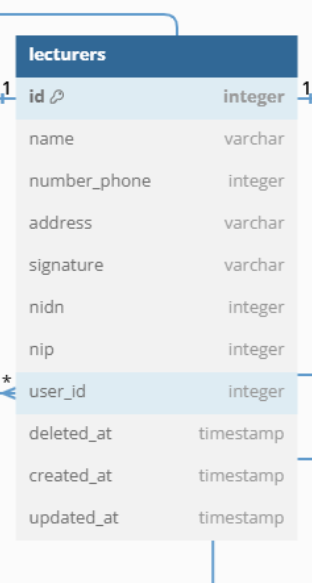
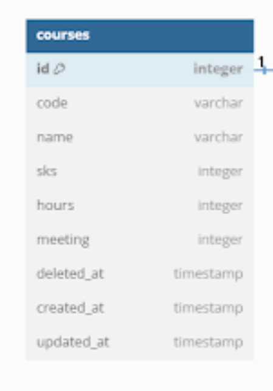
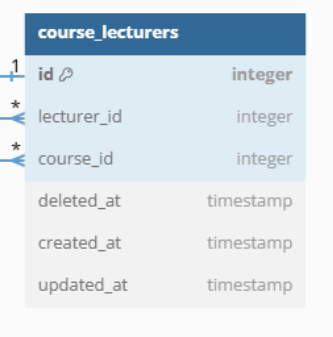
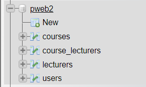
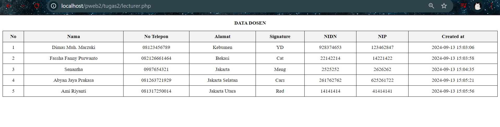
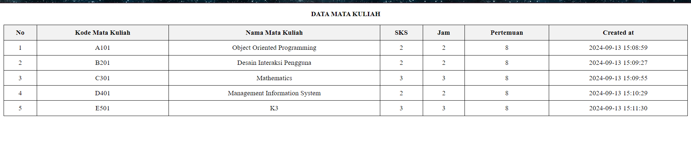
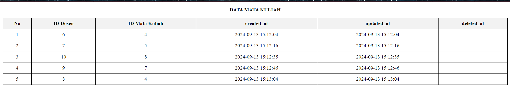

# Pemrograman Web 2 - Implemented CRUD using PHP OOP
### Web Programming Practicum II

Nama       : Fassha Fanny Purwanto  
Kelas      : TI - 2B  
NPM        : 230202035  
Case Study : NPM 5,6 lecturers & course_lecturers  

Entity Relationship Diagram :  

  
  


Tugas :  
1. Create an OOP-based View, by retrieving data from the MySQL database


   Sebelum membuat program berbasis OOP, langkah pertama yang harus dilakukan adalah membuat database menggunakan MySQL.

   > Membuat Database MySQL

   

   Dari gambar diatas dapat dilihat bahwa database yang dibuat bernama pweb2 dan lecturers, courses, course_lecturers serta users merupakan tabel didalam database yang nantinya akan berisi data sesuai dengan ketentuan yang berada pada ERD. Struktur tabel harus dibuat seperti yang ada di ERD dari mulai tipe data hingga primary key dan foreign key nya.
   Untuk membuat database beserta tabel nya ada berbagai macam cara, ada yang langsung membuatnya di PhpMyAdmin dan bisa juga melalui command prompt (cmd).

2. Use the _construct as a link to the database

      > Membuat file koneksi.php untuk menghubungkan kedalam database
      
      ```PHP
      class Database {
    private $host = "localhost";
    private $username = "root";
    private $password = "";
    private $database = "pweb2";
    protected $koneksi;
      ```
      
   
Potongan program diatas berisikan kelas database yang akan dijadikan dasar untuk memberikan koneksi ke database.

> Menggunakan Construct
```PHP
 function __construct() {
        $this->koneksi = mysqli_connect($this->host, $this->username, $this->password, $this->database);
        
        if (mysqli_connect_errno()) {
            die("Koneksi database gagal : " . mysqli_connect_error());
        }
    }
```
Metode Construct digunakan untuk menginisialisasi koneksi.  

> Membuat metode untuk menutup koneksi atau destruct.

```PHP
public function close() {
        mysqli_close($this->koneksi);
    }
```

3. Apply encapsulation according to the logic of the case study

   > Menerapkan Enkapsulasi sesuai kondisi studi kasus

   ```PHP
   class Database {
    private $host = "localhost";
    private $username = "root";
    private $password = "";
    private $database = "pweb2";
    protected $koneksi;
   ```

   Dalam potongan program diatas, enkapsulasi diterapkan dengan memberikan hak akses private kepada host, username, password, dan database agar hanya bisa diakses oleh kelas database itu sendiri serta hak akses protected koneksi agar hanya bisa diakses oleh kelas itu sendiri dan juga kelas turunannya.

4.  Create a derived class using the concept of inheritance

   > Membuat kelas turunan Lecturers dari kelas Database

   ```PHP
   class Lecturers extends Database {
    public function tampilData() {
        $query = "SELECT * FROM lecturers";
        $data = $this->query($query);

        $hasil = []; // Inisialisasi array hasil
        while ($row = mysqli_fetch_array($data, MYSQLI_ASSOC)) {
            $hasil[] = $row;
        }
        return $hasil;
    }

class Courses extends Database {
    public function tampilData() {
        $query = "SELECT * FROM courses";
        $data = $this->query($query);

        $hasil = []; // Inisialisasi array hasil
        while ($row = mysqli_fetch_array($data, MYSQLI_ASSOC)) {
            $hasil[] = $row;
        }
        return $hasil;
    }
}

class Courses_Lecturers extends Database {
    public function tampilData() {
        // Query untuk mengambil data yang terhubung antara lecturer dan course
        $query = "
            SELECT 
                cl.lecturer_id, 
                cl.course_id, 
                c.name AS course_name, 
                c.sks, 
                c.hours, 
                c.meeting, 
                cl.created_at, 
                cl.update_at, 
                cl.deleted_at
            FROM course_lecturers cl
            JOIN courses c ON cl.course_id = c.id
        ";
        $data = $this->query($query);

        $hasil = []; 
        while ($row = mysqli_fetch_array($data, MYSQLI_ASSOC)) {
            $hasil[] = $row;
        }
        return $hasil;
    }

   ```

Potongan program diatas merupakan kelas turunan dari kelas database. Didalam kelas kelas ini berisi function tampilData() yang berisi perintah untuk mengambil data dari database.  

> Full Kode Program koneksi.php

```PHP

<?php
// Kelas database sebagai kelas dasar dan penghubung ke database
class Database {
    private $host = "localhost";
    private $username = "root";
    private $password = "";
    private $database = "pweb2";
    protected $koneksi;

    // Constructor untuk inisialisasi koneksi
    function __construct() {
        $this->koneksi = mysqli_connect($this->host, $this->username, $this->password, $this->database);
        
        if (mysqli_connect_errno()) {
            die("Koneksi database gagal : " . mysqli_connect_error());
        }
    }

    // Metode untuk menjalankan query
    public function query($query) {
        return mysqli_query($this->koneksi, $query);
    }

    // Metode untuk menutup koneksi
    public function close() {
        mysqli_close($this->koneksi);
    }
}

// Kelas Lecturers sebagai kelas turunan dari kelas Database
class Lecturers extends Database {
    public function tampilData() {
        $query = "SELECT * FROM lecturers";
        $data = $this->query($query);

        $hasil = []; // Inisialisasi array hasil
        while ($row = mysqli_fetch_array($data, MYSQLI_ASSOC)) {
            $hasil[] = $row;
        }
        return $hasil;
    }
}

// Kelas Courses sebagai kelas turunan dari kelas database
class Courses extends Database {
    public function tampilData() {
        $query = "SELECT * FROM courses";
        $data = $this->query($query);

        $hasil = []; // Inisialisasi array hasil
        while ($row = mysqli_fetch_array($data, MYSQLI_ASSOC)) {
            $hasil[] = $row;
        }
        return $hasil;
    }
}

// Kelas Courses_Lecturers sebagai kelas turunan dari kelas database
class Courses_Lecturers extends Database {
    public function tampilData() {
        // Query untuk mengambil data yang terhubung antara lecturer dan course
        $query = "
            SELECT 
                cl.lecturer_id, 
                cl.course_id, 
                c.name AS course_name, 
                c.sks, 
                c.hours, 
                c.meeting, 
                cl.created_at, 
                cl.update_at, 
                cl.deleted_at
            FROM course_lecturers cl
            JOIN courses c ON cl.course_id = c.id
        ";
        $data = $this->query($query);

        $hasil = []; 
        while ($row = mysqli_fetch_array($data, MYSQLI_ASSOC)) {
            $hasil[] = $row;
        }
        return $hasil;
    }
}
?>
```


5. Apply polymorphism for at least 2 roles according to the case study

   > Membuat file lecturer.php 

   ```PHP
   require_once('koneksi.php');
   ```

   Didalam file lecturer.php potongan program diatas berfungsi untuk memanggil file koneksi.php agar bisa terhubung ke database.

   > Instansiasi Objek dan memanggil metode untuk kelas Lecturer

   ```PHP
   $tampilDosen = new Lecturers();
   $data = $tampilDosen->tampilData();
    ```

   > Membuat destruct koneksi

   ```PHP
   $tampilDosen->close();
   ```

   > Membuat html untuk tabel dan pemanggilan data kedalam tabel

   ```PHP
   <!DOCTYPE html>
   <html>
   <head>
	<title>Data Dosen</title>
   <style>
        table {
            width: 100%;
            border-collapse: collapse;
        }
        th, td {
            border: 1px solid #000;
            padding: 8px;
            text-align: center;
        }
        th {
            background-color: #f2f2f2;
        }
        .header {
            text-align: center;
            font-weight: bold;
        }
    </style>
   </head>
   <body>
	<p><b><center>DATA DOSEN</center></b></p>
   <table border="1">
		<tr>
			<th>No</th>
			<th>Nama</th>
            <th>No Telepon</th>
			<th>Alamat</th>
			<th>Signature</th>
			<th>NIDN</th>
			<th>NIP</th>
            <th>Created at</th>
   ```  
  > Memanggil data dari database kedalam tabel

```PHP
<td><?php echo $no++; ?></td>
<td><?php echo $row['name']; ?></td>
<td><?php echo $row['number_phone']; ?></td>
<td><?php echo $row['address']; ?></td>
<td><?php echo $row['signature']; ?></td>
<td><?php echo $row['nidn']; ?></td>
<td><?php echo $row['nip']; ?></td>
<td><?php echo $row['created_at']; ?></td>
```

> Full Kode Program Lecturer.php

```PHP

<?php
//Memanggil file koneksi.php untuk menghubungkan ke database
require_once('koneksi.php');

// Instansiasi Objek untuk kelas lecturer
$tampilDosen = new Lecturers();
$data = $tampilDosen->tampilData();

// Destruct Database
$tampilDosen->close();
?>

<!DOCTYPE html>
<html>
<head>
	<title>Data Dosen</title>
<!--Styling main Content-->
	<style>
        table {
            width: 100%;
            border-collapse: collapse;
        }
        th, td {
            border: 1px solid #000;
            padding: 8px;
            text-align: center;
        }
        th {
            background-color: #f2f2f2;
        }
        .header {
            text-align: center;
            font-weight: bold;
        }
    </style>
</head>
<body>
	<p><b><center>DATA DOSEN</center></b></p>
<table border="1">
		<tr>
	<!--Membuat tabel yang akan di isi data dari database-->
			<th>No</th>
			<th>Nama</th>
            <th>No Telepon</th>
			<th>Alamat</th>
			<th>Signature</th>
			<th>NIDN</th>
			<th>NIP</th>
            <th>Created at</th>
		</tr>
		<?php 
		$no = 1;
		foreach($data as $row){
		?>
			<tr>
		<!--Memanggil data dari database kedalam tabel-->
				<td><?php echo $no++; ?></td>
				<td><?php echo $row['name']; ?></td>
                <td><?php echo $row['number_phone']; ?></td>
				<td><?php echo $row['address']; ?></td>
				<td><?php echo $row['signature']; ?></td>
				<td><?php echo $row['nidn']; ?></td>
                <td><?php echo $row['nip']; ?></td>
                <td><?php echo $row['created_at']; ?></td>
               </tr>
			<?php 
		}
		?>
	</table>
	
</body>
</html>
```

> Output

  


> Membuat file course.php

```PHP
require_once('koneksi.php');
```
Potongan program diatas berfungsi untuk menghubungkan dengan database.  

> Instansiasi Objek untuk kelas Course

```PHP
$tampilCourse = new Courses();
$data = $tampilCourse->tampilData();
```

> Membuat destruct koneksi / menutup koneksi

```PHP
$tampilCourse->close();
```

> Membuat html untuk membuat tabel

```PHP
<!DOCTYPE html>
<html>
<head>
	<title>Data Mata Kuliah</title>
	<style>
        table {
            width: 100%;
            border-collapse: collapse;
        }
        th, td {
            border: 1px solid #000;
            padding: 8px;
            text-align: center;
        }
        th {
            background-color: #f2f2f2;
        }
        .header {
            text-align: center;
            font-weight: bold;
        }
    </style>
</head>
<body>
	<p><center><b>DATA MATA KULIAH</b></center></p>
<table border="1">
		<tr>
			<th>No</th>
			<th>Kode Mata Kuliah</th>
            <th>Nama Mata Kuliah</th>
			<th>SKS</th>
			<th>Jam</th>
			<th>Pertemuan</th>
            <th>Created at</th>
```
> Memanggil data dari database kedalam tabel

```PHP
<td><?php echo $no++; ?></td>
<td><?php echo $row['code']; ?></td>
<td><?php echo $row['name']; ?></td>
<td><?php echo $row['sks']; ?></td>
<td><?php echo $row['hours']; ?></td>
<td><?php echo $row['meeting']; ?></td>
<td><?php echo $row['created_at']; ?></td>
```

> Full kode Program untuk course.php

```PHP
<?php
//Memanggil file koneksi.php untuk menghubungkan ke database
require_once('koneksi.php');

//Instansiasi Objek untuk kelas Courses
$tampilCourse = new Courses();
$data = $tampilCourse->tampilData();

// Destruct Koneksi
$tampilCourse->close();
?>

<!DOCTYPE html>
<html>
<head>
	<title>Data Mata Kuliah</title>
	<style>
        table {
            width: 100%;
            border-collapse: collapse;
        }
        th, td {
            border: 1px solid #000;
            padding: 8px;
            text-align: center;
        }
        th {
            background-color: #f2f2f2;
        }
        .header {
            text-align: center;
            font-weight: bold;
        }
    </style>
</head>
<body>
	<p><center><b>DATA MATA KULIAH</b></center></p>
<table border="1">
		<tr>
			<th>No</th>
			<th>Kode Mata Kuliah</th>
            <th>Nama Mata Kuliah</th>
			<th>SKS</th>
			<th>Jam</th>
			<th>Pertemuan</th>
            <th>Created at</th>
		</tr>
		<?php 
		$no = 1;
		foreach($data as $row){
			?>
			<tr>
		<!--Memanggil data adari database kedalam tabel-->
				<td><?php echo $no++; ?></td>
				<td><?php echo $row['code']; ?></td>
                <td><?php echo $row['name']; ?></td>
				<td><?php echo $row['sks']; ?></td>
				<td><?php echo $row['hours']; ?></td>
				<td><?php echo $row['meeting']; ?></td>
                <td><?php echo $row['created_at']; ?></td>
               </tr>
			<?php 
		}
		?>
	</table>
	<br>
</body>
</html>
```

>Output

  


> Membuat file course-lecturer.php

```PHP
require_once('koneksi.php');
```

> Instansiasi Objek untuk kelas Courses_lecturers
```PHP
$tampilCourse = new Courses_Lecturers();
$data = $tampilCourse->tampilData();
```

> Membuat destruct untuk menutup koneksi

``PHP  
$tampilCourse->close();  
```

> Membuat HTML untuk tabel

```PHP
<!DOCTYPE html>
<html>
<head>
	<title>Data Mata Kuliah</title>
<!--Untuk styling main content-->
	<style>
        table {
            width: 100%;
            border-collapse: collapse;
        }
        th, td {
            border: 1px solid #000;
            padding: 8px;
            text-align: center;
        }
        th {
            background-color: #f2f2f2;
        }
        .header {
            text-align: center;
            font-weight: bold;
        }
    </style>
</head>
<body>
	<p><center><b>DATA MATA KULIAH</b></center></p>
<table border="1">
		<tr>
	<!--Membuat tabel untuk di isi data dari database-->
			<th>No</th>
			<th>ID Dosen</th>
            <th>ID Mata Kuliah</th>
			<th>created_at</th>
			<th>updated_at</th>
			<th>deleted_at</th>
```

> Memanggil data dari database ke dalam tabel

```PHP
<td><?php echo $no++; ?></td>
<td><?php echo $row['lecturer_id']; ?></td>
<td><?php echo $row['course_id']; ?></td>
<td><?php echo $row['created_at']; ?></td>
<td><?php echo $row['update_at']; ?></td>
<td><?php echo $row['deleted_at']; ?></td>
```

> Full Kode Program course-lecturer.php

```PHP
<?php
//Memanggil file koneksi.php untuk menghubungkan ke database
require_once('koneksi.php');
//Instansiasi Objek Untuk kelas Courses_Lecturers
$tampilCourse = new Courses_Lecturers();
$data = $tampilCourse->tampilData();

// Destruct Koneksi
$tampilCourse->close();
?>

<!DOCTYPE html>
<html>
<head>
	<title>Data Mata Kuliah</title>
<!--Untuk styling main content-->
	<style>
        table {
            width: 100%;
            border-collapse: collapse;
        }
        th, td {
            border: 1px solid #000;
            padding: 8px;
            text-align: center;
        }
        th {
            background-color: #f2f2f2;
        }
        .header {
            text-align: center;
            font-weight: bold;
        }
    </style>
</head>
<body>
	<p><center><b>DATA MATA KULIAH</b></center></p>
<table border="1">
		<tr>
	<!--Membuat tabel untuk di isi data dari database-->
			<th>No</th>
			<th>ID Dosen</th>
            <th>ID Mata Kuliah</th>
			<th>created_at</th>
			<th>updated_at</th>
			<th>deleted_at</th>
       
		</tr>
		<?php 
		$no = 1;
		foreach($data as $row){
			?>
			<tr>
		<!--Memanggil data dari database kedalam tabel-->
				<td><?php echo $no++; ?></td>
				<td><?php echo $row['lecturer_id']; ?></td>
      <td><?php echo $row['course_id']; ?></td>
				<td><?php echo $row['created_at']; ?></td>
				<td><?php echo $row['update_at']; ?></td>
				<td><?php echo $row['deleted_at']; ?></td>
               </tr>
			<?php 
		}
		?>
	</table>
	<br>
</body>
</html>
```

> Output

  

> Membuat file index.php

```PHP
require_once('koneksi.php');
```

> Instansiasi objek dan pemanggilan metode dengan konsep Polimorfisme

Polimorfisme adalah konsep dalam pemrograman berorientasi objek yang memungkinkan objek-objek yang berbeda untuk merespons ke panggilan metode dengan cara yang berbeda, meskipun metode tersebut memiliki nama yang sama.  
```PHP
$tampilDosen = new Lecturers();
$dataDosen = $tampilDosen->tampilData();

$tampilCourseL = new Courses_Lecturers();
$dataCourse = $tampilCourseL->tampilData();
```

Potongan program diatas melakukan konsep polimorfisme terhadap pemanggilan kelas lecturers dan courses_lecturers yaitu melakukan pemanggilan hanya dengan satu metode yaitu tampilData().  

> Menutup koneksi database

```PHP
$tampilDosen->close();
$tampilCourseL->close();
```

> Membuat file HTML untuk tabel

```PHP
<!DOCTYPE html>
<html lang="en">
<head>
    <meta charset="UTF-8">
    <meta name="viewport" content="width=device-width, initial-scale=1.0">
    <title>Data Dosen dan Mata Kuliah</title>
    <style>
        table {
            width: 100%;
            border-collapse: collapse;
        }
        th, td {
            border: 1px solid #000;
            padding: 8px;
            text-align: center;
        }
        th {
            background-color: #f2f2f2;
        }
        .header {
            text-align: center;
            font-weight: bold;
        }
    </style>
</head>
<body>

    <!-- Tabel Gabungan Data Dosen dan Mata Kuliah -->
    <p class="header">DATA DOSEN DAN MATA KULIAH</p>
    <table>
        <tr>
            <th colspan="7">DATA DOSEN</th>
            <th colspan="8">DATA MATA KULIAH</th>
        </tr>
        <tr>
            <th>No</th>
            <th>Nama</th>
            <th>No Telepon</th>
            <th>Alamat</th>
            <th>Signature</th>
            <th>NIDN</th>
            <th>NIP</th>
            <th>Kode Mata Kuliah</th>
            <th>Nama Mata Kuliah</th>
            <th>SKS</th>
            <th>Jam</th>
            <th>Pertemuan</th>
            <th>Created at</th>
            <th>Updated at</th>
            <th>Deleted at</th>
```
> Menggabungkan data dari 2 tabel Lecturers dan Courses_Lecturer yang sudaj berelasi

```PHP
$no = 1;
unt = max(count($dataDosen), count($dataCourse));
for ($i = 0; $i < $maxCount; $i++) {
 // Dosen Data
 $dosenRow = isset($dataDosen[$i]) ? $dataDosen[$i] : array_fill_keys(['name', 'number_phone', 'address', 'signature', 'nidn', 'nip', 'created_at', 'updated_at'], '-');
 // Course Data
 $courseRow = isset($dataCourse[$i]) ? $dataCourse[$i] : array_fill_keys(['lecturer_id', 'course_id', 'course_name', 'sks', 'hours', 'meeting', 'created_at', 'update_at', 'deleted_at'], '-');
?>
```

> Memanggil data dari database kedalam tabel

```PHP
 <td><?php echo htmlspecialchars($no++); ?></td>
<td><?php echo htmlspecialchars($dosenRow['name']); ?></td>
<td><?php echo htmlspecialchars($dosenRow['number_phone']); ?></td>
<td><?php echo htmlspecialchars($dosenRow['address']); ?></td>
 <td><?php echo htmlspecialchars($dosenRow['signature']); ?></td>
<td><?php echo htmlspecialchars($dosenRow['nidn']); ?></td>
 <td><?php echo htmlspecialchars($dosenRow['nip']); ?></td>
<td><?php echo htmlspecialchars($courseRow['course_id']); ?></td>
<td><?php echo htmlspecialchars($courseRow['course_name']); ?></td>
<td><?php echo htmlspecialchars($courseRow['sks']); ?></td>
<td><?php echo htmlspecialchars($courseRow['hours']); ?></td>
 <td><?php echo htmlspecialchars($courseRow['meeting']); ?></td>
 <td><?php echo htmlspecialchars($courseRow['created_at']); ?></td>
<td><?php echo htmlspecialchars($courseRow['update_at']); ?></td>
 <td><?php echo htmlspecialchars($courseRow['deleted_at']); ?></td>
```

> Full Kode program index.php

```PHP

<?php
require_once('koneksi.php');

// Instansiasi objek dan menerapkan konsep polimorfisme
$tampilDosen = new Lecturers();
$dataDosen = $tampilDosen->tampilData();

$tampilCourseL = new Courses_Lecturers();
$dataCourse = $tampilCourseL->tampilData();

// menutup koneksi database
$tampilDosen->close();
$tampilCourseL->close();
?>

<!DOCTYPE html>
<html lang="en">
<head>
    <meta charset="UTF-8">
    <meta name="viewport" content="width=device-width, initial-scale=1.0">
    <title>Data Dosen dan Mata Kuliah</title>
    <style>
        table {
            width: 100%;
            border-collapse: collapse;
        }
        th, td {
            border: 1px solid #000;
            padding: 8px;
            text-align: center;
        }
        th {
            background-color: #f2f2f2;
        }
        .header {
            text-align: center;
            font-weight: bold;
        }
    </style>
</head>
<body>

    <!-- Tabel Gabungan Data Dosen dan Mata Kuliah -->
    <p class="header">DATA DOSEN DAN MATA KULIAH</p>
    <table>
        <tr>
            <th colspan="7">DATA DOSEN</th>
            <th colspan="8">DATA MATA KULIAH</th>
        </tr>
        <tr>
            <th>No</th>
            <th>Nama</th>
            <th>No Telepon</th>
            <th>Alamat</th>
            <th>Signature</th>
            <th>NIDN</th>
            <th>NIP</th>
            <th>Kode Mata Kuliah</th>
            <th>Nama Mata Kuliah</th>
            <th>SKS</th>
            <th>Jam</th>
            <th>Pertemuan</th>
            <th>Created at</th>
            <th>Updated at</th>
            <th>Deleted at</th>
        </tr>
        <?php 
        $no = 1;
        //Untuk menggabungkan 2 tabel dosen dan courses untuk ditampilkan bersama sama
        $maxCount = max(count($dataDosen), count($dataCourse));
        for ($i = 0; $i < $maxCount; $i++) {
            // Dosen Data
            $dosenRow = isset($dataDosen[$i]) ? $dataDosen[$i] : array_fill_keys(['name', 'number_phone', 'address', 'signature', 'nidn', 'nip', 'created_at', 'updated_at'], '-');

            // Course Data
            $courseRow = isset($dataCourse[$i]) ? $dataCourse[$i] : array_fill_keys(['lecturer_id', 'course_id', 'course_name', 'sks', 'hours', 'meeting', 'created_at', 'update_at', 'deleted_at'], '-');
            ?>
            <tr>
        <!--Memanggil data dari database kedalam tabel-->
                <td><?php echo htmlspecialchars($no++); ?></td>
                <td><?php echo htmlspecialchars($dosenRow['name']); ?></td>
                <td><?php echo htmlspecialchars($dosenRow['number_phone']); ?></td>
                <td><?php echo htmlspecialchars($dosenRow['address']); ?></td>
                <td><?php echo htmlspecialchars($dosenRow['signature']); ?></td>
                <td><?php echo htmlspecialchars($dosenRow['nidn']); ?></td>
                <td><?php echo htmlspecialchars($dosenRow['nip']); ?></td>
                <td><?php echo htmlspecialchars($courseRow['course_id']); ?></td>
                <td><?php echo htmlspecialchars($courseRow['course_name']); ?></td>
                <td><?php echo htmlspecialchars($courseRow['sks']); ?></td>
                <td><?php echo htmlspecialchars($courseRow['hours']); ?></td>
                <td><?php echo htmlspecialchars($courseRow['meeting']); ?></td>
                <td><?php echo htmlspecialchars($courseRow['created_at']); ?></td>
                <td><?php echo htmlspecialchars($courseRow['update_at']); ?></td>
                <td><?php echo htmlspecialchars($courseRow['deleted_at']); ?></td>
            </tr>
        <?php 
        }
        ?>
    </table>

</body>
</html>
```

> Output

  


   
      
