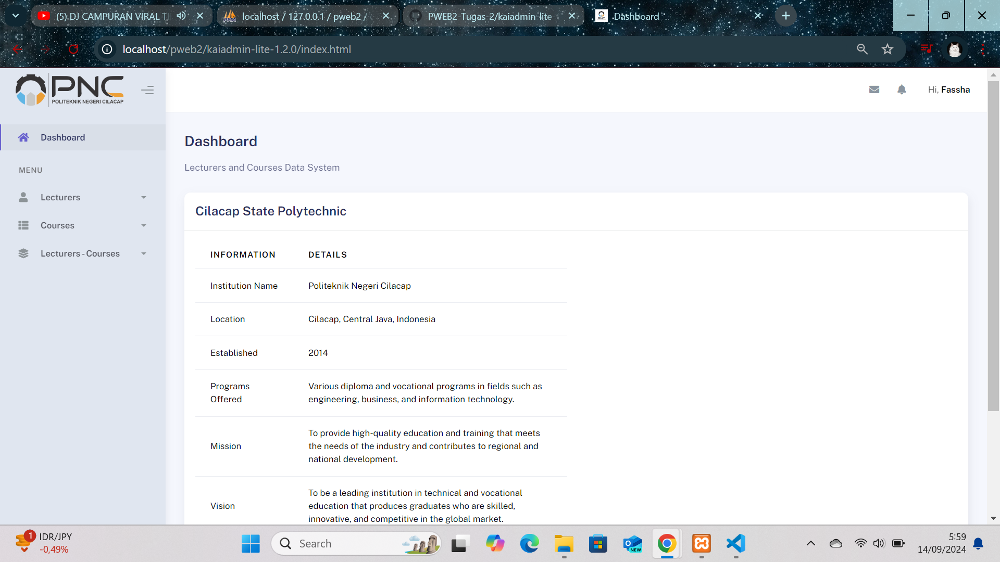
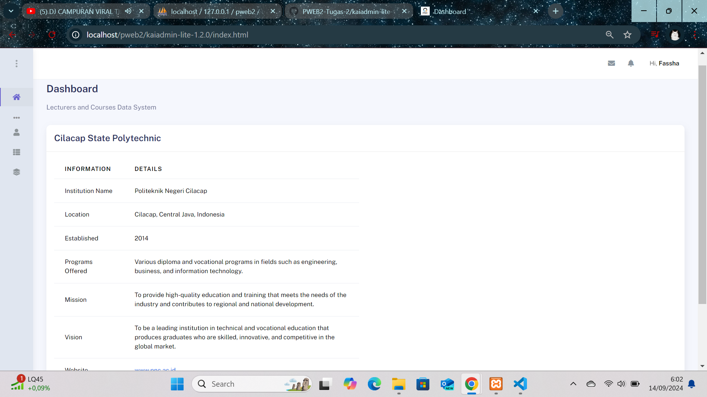
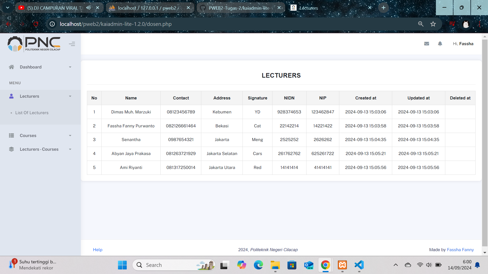
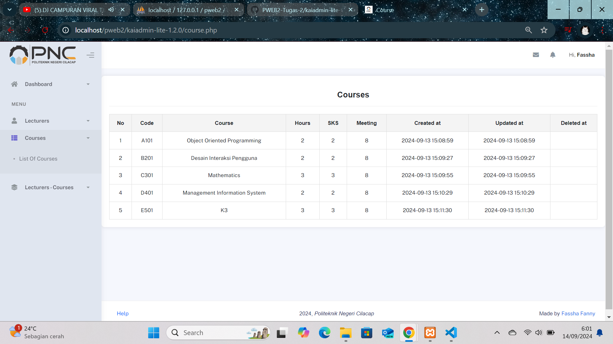
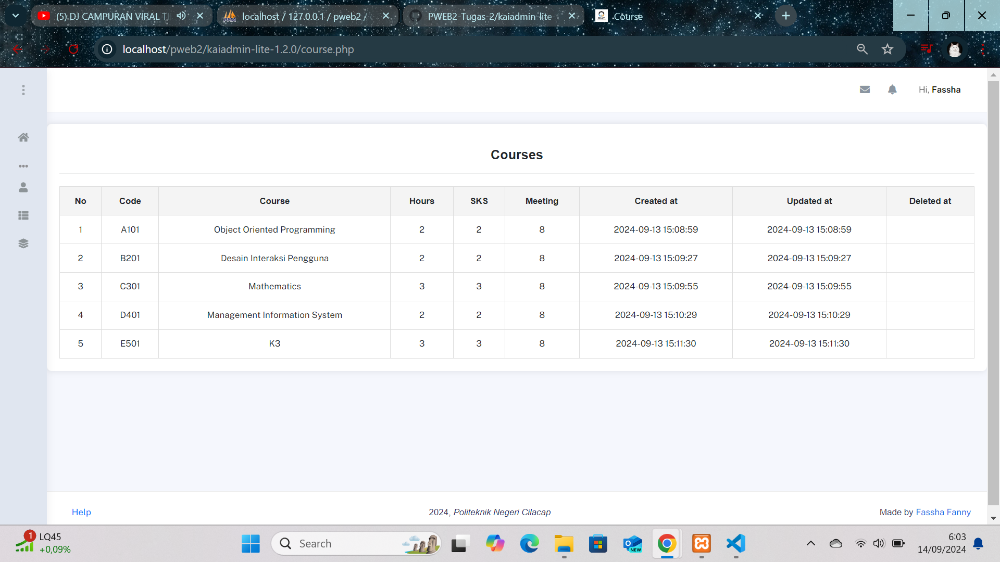
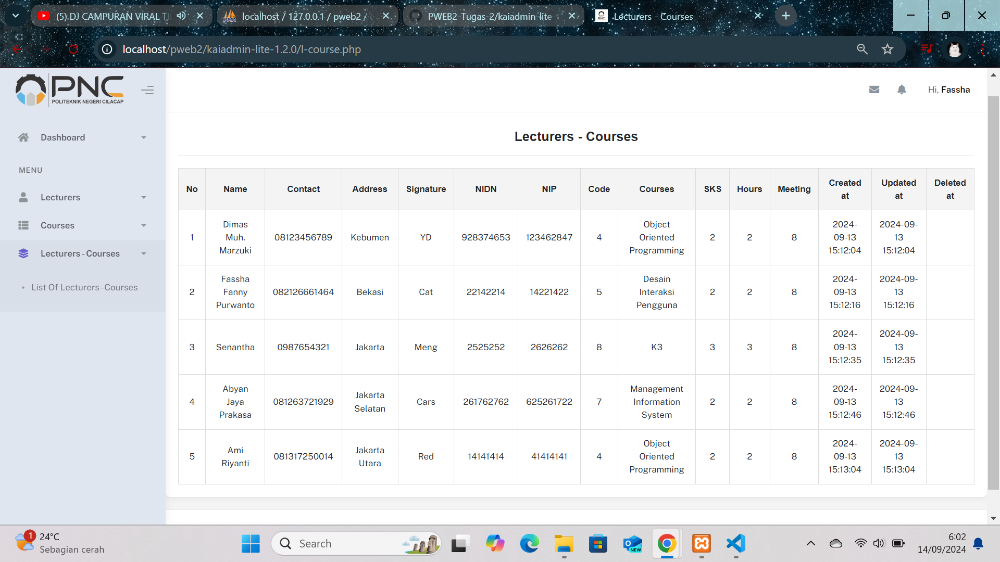

# Tugas 2 - Implemented CRUD using PHP OOP
## Penerapan dengan Bootstrap
_Bootstrap adalah framework front-end open-source yang digunakan untuk merancang dan membangun halaman web yang responsif dan estetik. Framework ini menyediakan kumpulan komponen CSS dan JavaScript yang siap pakai, seperti tombol, formulir, dan navigasi, yang dirancang untuk mempermudah pengembangan web dengan desain yang modern dan konsisten._
***
Tugas 2 ini menggunakan penerapan Bootstrap untuk menciptakan halaman web yang responsif dengan desain modern dan antarmuka pengguna (UI) yang baik. Dengan menggunakan komponen dan sistem grid Bootstrap, halaman web harus mampu menyesuaikan tampilannya dengan berbagai ukuran layar. Fokus utama adalah pada penerapan desain yang bersih dan kontemporer, serta memastikan navigasi dan elemen UI yang intuitif dan mudah diakses.

# Dashboard

  

***
### Lecturer
  

***
### Courses
  

***
### Lecturer - Courses
  

***

